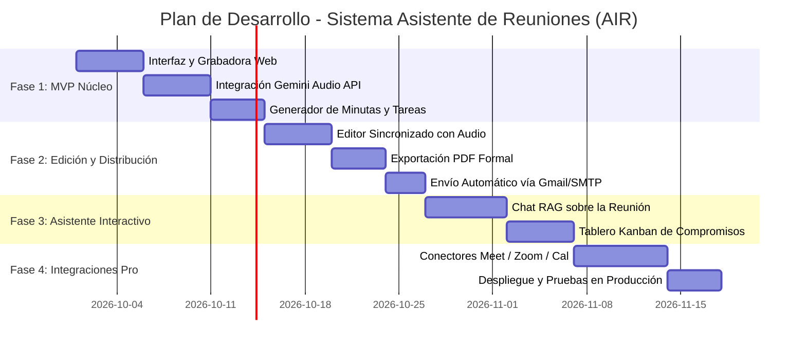

# AIR (Asistente Inteligente de Reuniones)
## Documento Maestro de Especificación de Requerimientos, Arquitectura y Plan de Proyecto
### Estándar AIDET v2.0 — El Profesional Potenciado por Tecnología

---

## 1. Resumen Ejecutivo, Identidad y Visión del Proyecto

### 1.1. Identidad Visual, Paleta Cromática e Iconografía
* **Paleta de Colores Neutros y Grises:** El sistema adopta una estética SaaS moderna, limpia, sobria y ejecutiva basada exclusivamente en **tonos neutros y escala de grises**:
  * **Blanco Puro y Gris Claro de Lienzo (`#FFFFFF`, `#F8FAFC`, `#F1F5F9`):** Superficies principales, fondos de tarjetas y áreas de lectura para máxima legibilidad.
  * **Grises Medios de Estructura y Bordes (`#E2E8F0`, `#CBD5E1`, `#94A3B8`):** Delimitadores sutiles, líneas de separación, tabs inactivos y bordes de componentes.
  * **Grises Oscuros y Carbón de Texto (`#334155`, `#1E293B`, `#0F172A`):** Tipografía de alto contraste, botones primarios sobrios y cabeceras elegantes.
  * **Acentos de Estado Suaves:** Indicadores discretos de estado (gris pizarra para inactivo, gris oscuro para activo, verde oliva/esmeralda sutil para completado).
* **Rol del Logo del Búho:**
  * El logo del búho (`assets/icons/logo-buho.jpg`) **no domina visualmente la interfaz** ni condiciona una estética oscura. Se utiliza con discreción como un **ícono pequeño de software** (avatar/badge de 24x24px a 32x32px) en la barra de navegación superior, en el encabezado de las plantillas de minutas y como sello sutil en los reportes exportados.

### 1.2. Declaración del Problema
En el entorno empresarial y académico moderno, las reuniones consumen una proporción crítica del tiempo laboral. Sin embargo, adolecen frecuentemente de las siguientes ineficiencias:
1. **Pérdida de Información Clave:** Detalles, ideas y debates se olvidan poco después de concluida la sesión.
2. **Minutas Tardías o Inexistentes:** La redacción manual de actas toma horas, desvía el foco de los participantes y con frecuencia se pospone indefinidamente.
3. **Falta de Seguimiento a Compromisos:** Las tareas acordadas ("action items") no quedan registradas con un responsable directo ni fecha límite estricta, lo que genera dilación y retrabajo.
4. **Barrera de Búsqueda Histórica:** No existe un mecanismo ágil para responder preguntas como *"¿Quién se comprometió a entregar la cotización del cliente X y para qué fecha?"* sin tener que escuchar horas de grabación.

### 1.3. Propósito y Propuesta de Valor
El **Asistente Inteligente de Reuniones (AIR)** es una solución web integral estructurada dentro de la carpeta `/asistente-reuniones`, potenciada por Inteligencia Artificial generativa y procesamiento de audio multimodal. Su objetivo es transformar automáticamente cualquier reunión (presencial o virtual) en:
* Una **transcripción estructurada y fidedigna** con identificación de participantes (diarización).
* Una **minuta ejecutiva formal** generada en segundos (resumen, temas tratados, puntos clave).
* Una **matriz operativa de compromisos y acuerdos** con asignación automática de responsables y plazos.
* Un **asistente conversacional ("Preguntas sobre la sesión")** capaz de responder cualquier duda sobre la reunión con citas precisas.
* Un **sistema de exportación a PDF formal corporativo** y distribución por correo electrónico.

### 1.4. Alineación con el Estándar AIDET v2.0
Siguiendo la filosofía **AIDET**:
> *"El participante define el resultado; Antigravity selecciona la arquitectura, construye, prueba, despliega y publica."*

El sistema se diseña para operar con **fricción técnica cero** para los usuarios finales, integrando capacidades nativas del ecosistema web moderno y servicios cloud/Google Workspace sin requerir instalaciones complejas.

---

## 2. Perfiles de Usuario y Casos de Uso

### 2.1. Perfiles de Usuario (Roles)
| Rol | Descripción | Responsabilidades en la Plataforma |
| :--- | :--- | :--- |
| **Organizador / Moderador** | Convocante o líder de la reunión. | Inicia/detiene la grabación, sube audios externos, revisa y aprueba el acta generada, dispara la distribución. |
| **Participante / Asistente** | Asistente presencial o remoto. | Consulta el acta final, recibe sus tareas asignadas por correo, interactúa con el chat de consulta. |
| **Responsable de Compromisos** | Persona con tareas asignadas. | Actualiza el estado de cumplimiento de sus tareas en el tablero Kanban de seguimiento. |
| **Administrador del Sistema** | Gestor de la plataforma y seguridad. | Configura credenciales de IA, políticas de retención de grabaciones, control de acceso y auditoría. |

### 2.2. Historias de Usuario Principales (Criterios de Aceptación)

#### HU-01: Grabación en Vivo desde Navegador
* **Como** Organizador de la reunión.
* **Quiero** presionar un botón para grabar el audio ambiental de la reunión directamente desde mi computadora o teléfono.
* **Para** no depender de aplicaciones de terceros ni configuraciones complicadas de hardware.
* **Criterio de Aceptación:**
  * Debe solicitar permiso de micrófono con retroalimentación visual clara.
  * Debe mostrar un indicador de grabación activo con cronómetro y visualizador de onda (VU meter / Canvas waveform).
  * Debe permitir pausar, reanudar y detener la grabación sin pérdida de búfer.

#### HU-02: Carga de Archivos de Grabaciones Previas
* **Como** Organizador o Participante.
* **Quiero** subir un archivo de audio o video ya grabado (`.mp3`, `.wav`, `.m4a`, `.mp4`, `.ogg`).
* **Para** procesar reuniones grabadas con grabadoras externas, Zoom, Google Meet o notas de voz móviles.
* **Criterio de Aceptación:**
  * Zona Drag & Drop con validación de formato y tamaño máximo configurable (e.g., hasta 100 MB en navegador / compresión automática).
  * Barra de progreso de carga y previsualización de metadatos (duración, peso, tipo de archivo).

#### HU-03: Generación de Minuta Inteligente y Matriz de Acuerdos
* **Como** Organizador.
* **Quiero** que la IA analice el audio y entregue automáticamente un informe ejecutivo estructurado.
* **Para** disponer de la minuta lista en menos de 2 minutos tras terminar la sesión.
* **Criterio de Aceptación:**
  * Estructura estándar obligatoria: 1) Título y Metadatos, 2) Resumen Ejecutivo (3-5 párrafos), 3) Puntos Tratados por Tema, 4) Tabla de Acuerdos/Decisiones, 5) Tabla de Tareas/Action Items con Responsable y Fecha.
  * Capacidad de edición manual en vivo antes de dar el visto bueno final.

#### HU-04: Chat Interactivo con la Reunión ("Pregúntale al Asistente")
* **Como** Participante o Gerente ausente.
* **Quiero** hacer preguntas en lenguaje natural sobre lo que se habló en la reunión.
* **Para** obtener respuestas rápidas sin tener que leer todo el documento o escuchar el audio.
* **Criterio de Aceptación:**
  * Respuestas contextualizadas fundamentadas exclusivamente en la transcripción.
  * Inclusión del minuto exacto (`[00:14:25]`) donde se mencionó la respuesta.

#### HU-05: Exportación Formal a PDF y Envío por Correo
* **Como** Organizador.
* **Quiero** exportar la minuta en formato PDF con diseño institucional y enviarla a los correos de los asistentes con un clic.
* **Para** cumplir con la formalidad corporativa y asegurar la rendición de cuentas inmediata.

---

## 3. Arquitectura del Sistema y Flujo de Información

```
┌──────────────────────────────────────────────────────────────────────────┐
│                         CAPA DE ENTRADA Y CAPTURA                        │
│  [ Micrófono Web Audio API ]  ó  [ Carga de Archivos (MP3/M4A/WAV/MP4) ] │
└────────────────────────────────────┬─────────────────────────────────────┘
                                     │ Stream / Blobs de Audio
                                     ▼
┌──────────────────────────────────────────────────────────────────────────┐
│                   MOTOR DE PROCESAMIENTO MULTIMODAL                      │
│                                                                          │
│  1. Preprocesamiento & Compresión (AudioContext / Resampling a 16kHz)     │
│  2. Ingesta a IA (Google Gemini 1.5 / 2.0 Flash Multimodal Audio)        │
│     ├── Transcripción fonética & corrección ortotipográfica              │
│     ├── Diarización de interlocutores (Identificación de participantes)  │
│     └── Extracción estructurada JSON:                                    │
│         • Resumen Ejecutivo                                              │
│         • Decisiones Firmes                                              │
│         • Action Items: {tarea, responsable, plazo, prioridad}           │
└────────────────────────────────────┬─────────────────────────────────────┘
                                     │ Salida estructurada (JSON)
                                     ▼
┌──────────────────────────────────────────────────────────────────────────┐
│                     CAPA DE APLICACIÓN Y PRESENTACIÓN                     │
│                                                                          │
│  ┌─────────────────────────┐  ┌────────────────────────────────────────┐  │
│  │ Dashboard de la Reunión │  │ Editor Interactivo de la Minuta        │  │
│  │ - Reproductor con marcas│  │ - Ajuste de acuerdos y asignaciones    │  │
│  │ - Buscador en vivo      │  │ - Control de versiones del borrador    │  │
│  └─────────────────────────┘  └────────────────────────────────────────┘  │
│  ┌─────────────────────────┐  ┌────────────────────────────────────────┐  │
│  │ Chat RAG con la Sesión  │  │ Tablero Kanban de Tareas Pendientes    │  │
│  │ "¿Qué dijo Juan sobre X?"│  │ [Por Hacer] -> [En Progreso] -> [Listo]│  │
│  └─────────────────────────┘  └────────────────────────────────────────┘  │
└────────────────────────────────────┬─────────────────────────────────────┘
                                     │
                                     ▼
┌──────────────────────────────────────────────────────────────────────────┐
│                    CAPA DE DISTRIBUCIÓN Y ALMACENAMIENTO                 │
│  • Generador PDF (jsPDF / HTML2Canvas) con cabecera corporativa          │
│  • Conexión Google Workspace (Drive para audios/actas, Gmail para envío) │
│  • Persistencia Local / IndexedDB / Sheets API para auditoría de tareas  │
└──────────────────────────────────────────────────────────────────────────┘
```

---

## 4. Módulos y Capacidades Funcionales

### Módulo A: Interfaz de Grabación y Carga de Medios
* **Grabador en Tiempo Real:**
  * Uso de la API estándar `MediaRecorder` del navegador con códec `audio/webm;codecs=opus` o fallback `audio/mp4`.
  * Visualización en vivo mediante `AudioContext` y `AnalyserNode` para graficar el nivel de volumen (indicando si el audio es claro o silencioso).
  * Temporizador visible con auto-guardado local en `IndexedDB` para evitar pérdidas ante desconexiones accidentales.
* **Cargador Universal (Uploader):**
  * Soporte de arrastrar y soltar (Drag & Drop).
  * Extracción de audio en el navegador si se suministra un video `.mp4` para ahorrar ancho de banda.
  * Soporte de segmentación (chunking) para audios de larga duración (> 1 hora).

### Módulo B: Motor de Inteligencia Artificial (Core de Análisis)
* **Ingesta Multimodal Directa:**
  * Aprovecha la capacidad nativa de Google Gemini de ingerir audio crudo (speech-to-text + entendimiento semántico simultáneo sin pérdida de tono o énfasis).
* **Prompt Maestro del Analista de Reuniones:**
  * Instrucción de sistema diseñada para evitar alucinaciones, garantizando que los nombres de los asignados y fechas provengan textualmente del audio.
  * Clasificación automática de intervenciones por temas (Agenda vs. Puntos varios).
* **Extracción de Tareas con Metadatos Estrictos:**
  * Generación en formato JSON Schema validado:
    ```json
    {
      "titulo_reunion": "string",
      "fecha_hora": "YYYY-MM-DD HH:mm",
      "participantes_detectados": ["Nombre 1", "Nombre 2"],
      "resumen_ejecutivo": "string",
      "temas_tratados": [
        {"tema": "string", "discusion": "string", "conclusiones": "string"}
      ],
      "acuerdos": [
        {"id": "AC-01", "descripcion": "string", "impacto": "Alto/Medio/Bajo"}
      ],
      "compromisos_tareas": [
        {
          "id": "TAR-01",
          "tarea": "string",
          "responsable": "string",
          "fecha_limite": "YYYY-MM-DD",
          "prioridad": "Alta/Media/Baja",
          "estado": "Pendiente"
        }
      ]
    }
    ```

### Módulo C: Editor Interactivo y Panel de Aprobación
* Vista dividida: reproductor de audio sincronizado al lado izquierdo y minuta editable al lado derecho.
* Resaltado de marcas de tiempo cliqueables (`[12:34]`): al hacer clic sobre una frase o acuerdo, el reproductor salta inmediatamente a ese segundo del audio para contrastar la veracidad.
* Validación humana previa a la emisión ("Human-in-the-loop"): el moderador puede modificar nombres, ajustar plazos o borrar temas confidenciales antes de emitir la versión oficial.

### Módulo D: Asistente Conversacional Contextual (Chat RAG)
* Interfaz de chat integrada en la barra lateral.
* Respuestas instantáneas basadas en el contexto completo de la transcripción y las notas.
* Sugerencias de preguntas rápidas preconfiguradas:
  * *"Resume los puntos de desacuerdo durante la reunión."*
  * *"Lista únicamente las tareas asignadas a [Nombre]."*
  * *"¿Qué presupuesto o cifras se mencionaron?"*
  * *"Genera un correo de 1 párrafo para informar a la gerencia."*

### Módulo E: Generador de Actas Formales (PDF Corporativo)
* Renderizado dinámico de documento formal imprimible:
  * Membrete institucional, número de correlativo de acta (`ACTA-2026-XXXX`), fecha, lugar y lista de firmas de conformidad.
  * Tipografía y estilo editorial pulcro apto para juntas directivas, comités técnicos o minutas de proyecto.
  * Opciones de descarga: PDF firmado, Markdown (.md) y archivo JSON estructurado.

### Módulo F: Tablero de Seguimiento de Acuerdos (Mini-Kanban)
* Conversión de las tareas extraídas en tarjetas de seguimiento.
* Columnas de estado: **Por Iniciar**, **En Progreso**, **Bloqueado**, **Completado**.
* Filtro por responsable y alerta visual de tareas próximas a vencer.

---

## 5. Modelo de Datos y Esquemas

### 5.1. Entidad: Reunión (`Meeting`)
```sql
CREATE TABLE reuniones (
    id VARCHAR(36) PRIMARY KEY,
    titulo VARCHAR(255) NOT NULL,
    fecha_reunion DATETIME NOT NULL,
    duracion_segundos INT DEFAULT 0,
    organizador_email VARCHAR(120) NOT NULL,
    estado VARCHAR(30) DEFAULT 'grabando', -- 'grabando', 'procesando', 'borrador', 'aprobada', 'distribuida'
    ruta_audio VARCHAR(500),
    resumen_ejecutivo TEXT,
    creado_en TIMESTAMP DEFAULT CURRENT_TIMESTAMP,
    actualizado_en TIMESTAMP DEFAULT CURRENT_TIMESTAMP
);
```

### 5.2. Entidad: Participante (`Attendee`)
```sql
CREATE TABLE participantes (
    id VARCHAR(36) PRIMARY KEY,
    reunion_id VARCHAR(36) REFERENCES reuniones(id) ON DELETE CASCADE,
    nombre VARCHAR(120) NOT NULL,
    correo VARCHAR(120),
    cargo_rol VARCHAR(100),
    presente BOOLEAN DEFAULT TRUE
);
```

### 5.3. Entidad: Tarea / Compromiso (`ActionItem`)
```sql
CREATE TABLE tareas_compromiso (
    id VARCHAR(36) PRIMARY KEY,
    reunion_id VARCHAR(36) REFERENCES reuniones(id) ON DELETE CASCADE,
    codigo_correlativo VARCHAR(20), -- e.g. TAR-01
    descripcion TEXT NOT NULL,
    responsable_nombre VARCHAR(120),
    responsable_correo VARCHAR(120),
    fecha_limite DATE,
    prioridad VARCHAR(20) DEFAULT 'Media', -- 'Alta', 'Media', 'Baja'
    estado VARCHAR(30) DEFAULT 'Pendiente', -- 'Pendiente', 'En Progreso', 'Completada', 'Cancelada'
    marca_tiempo_audio INT -- Segundo del audio donde se originó
);
```

### 5.4. Entidad: Acuerdo / Decisión (`Decision`)
```sql
CREATE TABLE acuerdos (
    id VARCHAR(36) PRIMARY KEY,
    reunion_id VARCHAR(36) REFERENCES reuniones(id) ON DELETE CASCADE,
    codigo_correlativo VARCHAR(20), -- e.g. AC-01
    descripcion TEXT NOT NULL,
    categoria VARCHAR(50), -- 'Estratégico', 'Operativo', 'Financiero', 'Técnico'
    consenso_unánime BOOLEAN DEFAULT TRUE,
    marca_tiempo_audio INT
);
```

---

## 6. Stack Tecnológico Sugerido (Enfoque AIDET Ágil)

| Capa / Función | Tecnología Principal | Alternativa / Complemento | Justificación Técnica |
| :--- | :--- | :--- | :--- |
| **Frontend UI** | HTML5 Semántico + TailwindCSS + Vanilla JS moderno (ES6+) | Alpine.js o React ligero | **100% Responsive y Adaptativo:** Mobile-First, visualizador dinámico de audio, tablas con scroll táctil suave y prevención de zoom en iOS. Cero complejidad de build. |
| **Grabación Web** | Web Audio API + MediaRecorder API | RecordRTC | Compatibilidad nativa en navegadores móviles y de escritorio sin plugins. |
| **Motor de IA** | **Google Gemini 2.0 Flash / 1.5 Pro** | Whisper API (OpenAI) | Gemini procesa directamente audio nativo con ventana de contexto de más de 1 millón de tokens (hasta 9.5 horas de audio en un solo prompt). |
| **Backend & APIs** | Node.js (Express) | Google Apps Script (GAS) | Node.js permite procesar streams y webhooks; GAS permite integración nativa con Google Drive, Gmail y Sheets sin servidores dedicados. |
| **Almacenamiento** | Google Drive API / Cloud Storage | Local IndexedDB | Almacenamiento seguro, escalable y accesible de audios y minutas en PDF. |
| **Generación PDF** | jsPDF + AutoTable | Puppeteer / HTML-PDF | Generación en cliente o servidor con maquetación exacta e inmediata. |

---

## 7. Plan de Implementación por Fases (Roadmap)



### Detalle de Entregables por Fase:

#### Fase 1: MVP Operativo (Núcleo de Transcripción y Síntesis)
* Pantalla limpia con botón de grabación ambiental y selector de archivo de audio.
* Conexión con Gemini API para procesamiento de audio.
* Salida instantánea en pantalla: Título sugerido, Resumen ejecutivo, Tabla de acuerdos y Tabla de tareas.
* Botón de copiado al portapapeles y exportación en Markdown.

#### Fase 2: Edición Humana, PDF Formal y Distribución
* Visualizador con reproductor de audio integrado y timestamps clicables.
* Formulario interactivo para editar cualquier campo generado por la IA antes de guardarlo.
* Plantilla PDF corporativa estilizada con logotipo institucional, membrete y tabla de firmas.
* Despacho por correo electrónico a los correos registrados.

#### Fase 3: Inteligencia Conversacional (RAG) y Seguimiento Activo
* Barra lateral de chat ("Pregúntale al Asistente") con historial de preguntas.
* Tablero Kanban para cambiar el estado de las tareas (Pendiente -> En Proceso -> Hecho).
* Sistema de alertas por correo para tareas próximas a expirar.

#### Fase 4: Automatización e Identidad Web
* Publicación web del portal bajo el estándar AIDET.
* Integración opcional con Google Calendar para vincular automáticamente el título de la reunión, fecha y lista de invitados.

---

## 8. Consideraciones de Seguridad, Privacidad y Ética

1. **Aviso Legal de Consentimiento:** Toda sesión grabada en vivo debe mostrar un aviso visible de que la conversación está siendo capturada para fines de registro y acta de acuerdos.
2. **Encriptación y Privacidad:** Las grabaciones de voz e información estratégica no deben ser almacenadas en repositorios públicos. Los tokens de API deben mantenerse en variables de entorno seguras (`.env`).
3. **Control de Retención de Datos:** Opción configurable para eliminar automáticamente los archivos de audio pesados una vez aprobada y firmada la minuta final, conservando únicamente el acta y la transcripción de texto comprimida.
4. **Validación Antialucinación:** La IA debe tener una directriz estricta (`temperature: 0.1 - 0.2`) para evitar inventar compromisos, personas o fechas no sustentadas en la conversación grabada.

---

## 9. Estructura de Directorios Recomendada para el Proyecto

Para iniciar el desarrollo dentro del entorno de trabajo, se recomienda la siguiente organización limpia:

```
TALLER WEB/
├── PROYECTO_SISTEMA_ASISTENTE_REUNIONES.md  <-- Este documento maestro
├── asistente-reuniones/                     <-- Carpeta principal del nuevo proyecto
│   ├── index.html                           <-- Portal web del asistente
│   ├── css/
│   │   └── styles.css                       <-- Estilos y componentes visuales
│   ├── js/
│   │   ├── app.js                           <-- Lógica principal de UI y estado
│   │   ├── audio-recorder.js                <-- Módulo de captura y MediaRecorder
│   │   ├── ai-service.js                    <-- Cliente de conexión con Gemini / IA
│   │   ├── pdf-generator.js                 <-- Creación del acta formal en PDF
│   │   └── chat-assistant.js                <-- Interfaz conversacional RAG
│   ├── assets/
│   │   ├── icons/                           <-- Iconografía y micro-animaciones
│   │   └── templates/                       <-- Plantillas de minutas
│   └── docs/
│       └── manual_usuario.md                <-- Guía paso a paso para el usuario
```

---

## 10. Próximos Pasos para Iniciar la Construcción

1. **Aprobación de la Estructura:** Revisar este documento de requerimientos y validar prioridades.
2. **Aprovisionamiento de Claves API:** Configurar la clave de API de Gemini (`GEMINI_API_KEY`) para el procesamiento de audio multimodal.
3. **Creación del Prototipo UI (Fase 1):** Construir la interfaz de grabación y carga de archivos en `asistente-reuniones/index.html`.
4. **Pruebas de Ingesta de Audio:** Realizar pruebas de audio real (1 min, 5 min, 15 min) para calibrar el prompt de generación de actas.
